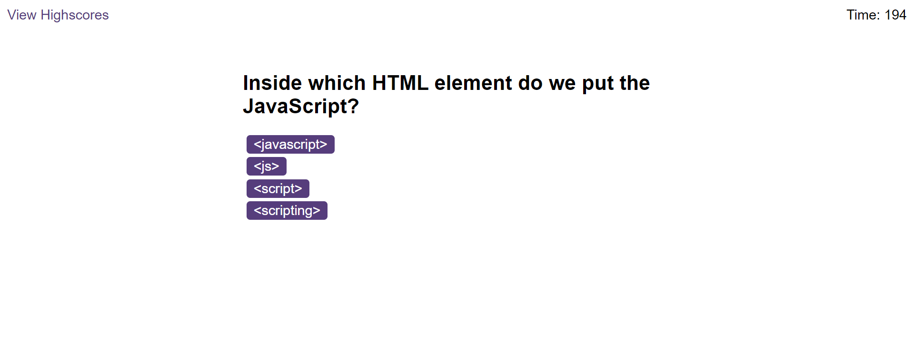

# Quiz App

## Description
The Quiz App is a simple web application designed to allow users to take a quiz on various topics. It features multiple-choice questions, a timer, feedback on correct and incorrect answers, and a high score leaderboard.

## Features

- **Multiple-choice Questions**: Users can choose from a set of predefined options for each question.
- **Timer**: The quiz includes a countdown timer to add a sense of urgency.
- **Feedback**: Users receive immediate feedback on their answers, indicating whether they were correct or incorrect.
- **High Score Leaderboard**: The app tracks and displays high scores, allowing users to compete for the top spot.

## Image of Application

## Link to Deployed Application

[Quiz App Link](https://adam-deb.github.io/code-quiz/)

